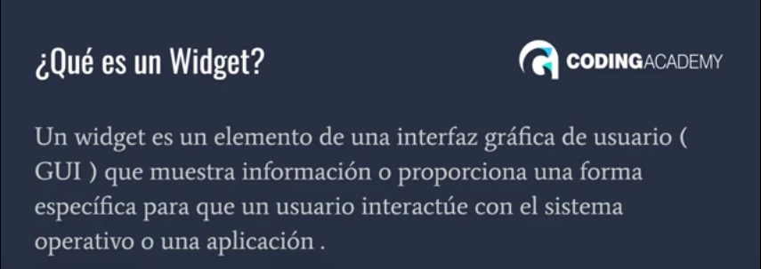
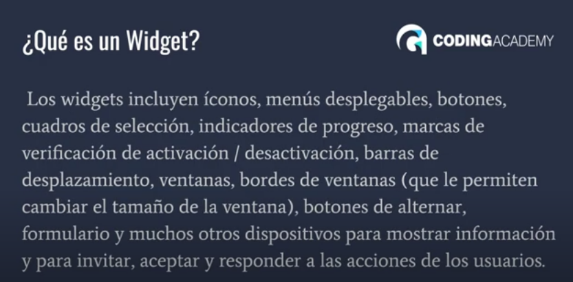
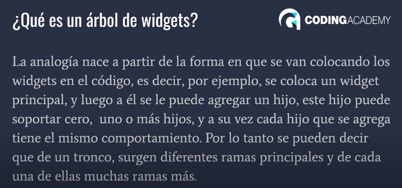
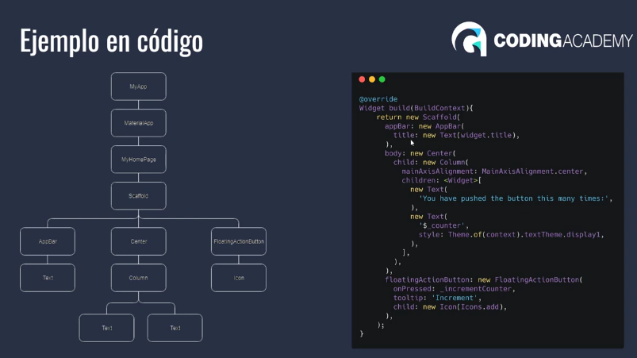
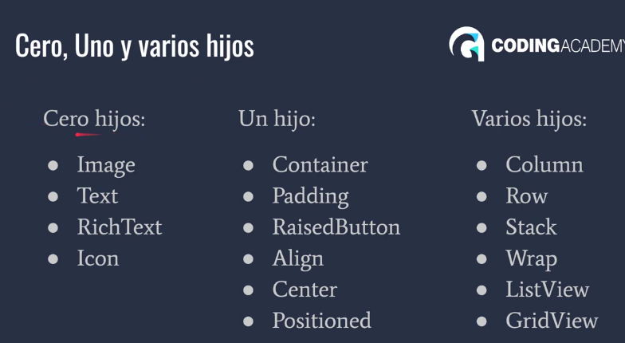
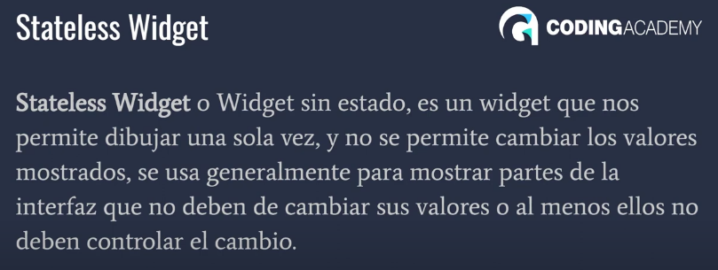
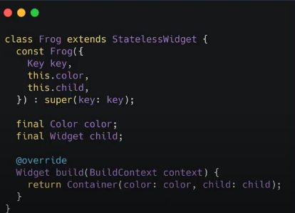
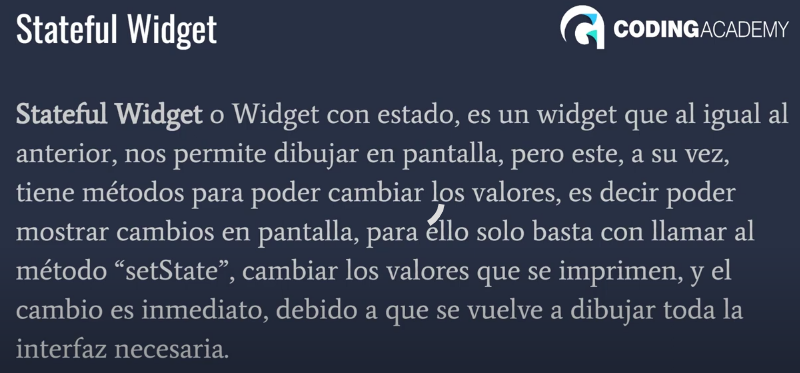
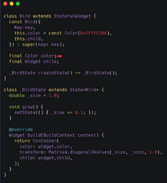
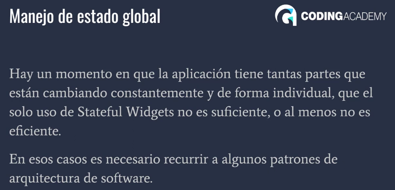

# Flutter




# Árbol de Widgets
en el build se define que árbol de widgets se va retornar




# Diferencias entre Stateless widget y stateful widget







# Primeros pasos con Text
```dart
import 'package:flutter/material.dart';

// Definir una clase llamada 'Inicio' que extiende de 'StatelessWidget'
class Inicio extends StatelessWidget {
  // Constructor de la clase 'Inicio' (sin parámetros)
  Inicio();

  // Método 'build' obligatorio que construye la interfaz de usuario
  @override
  Widget build(BuildContext context) {
    // 'Scaffold' es un widget para la estructura básica de la pantalla
    return Scaffold(
      // 'AppBar' representa la barra de navegación en la parte superior
      appBar: AppBar(),
      body: Center(
        // 'Center' centra su hijo en la pantalla
        child: Text(
          'hola', // Texto que se mostrará en la pantalla
          style: TextStyle(
            fontSize: 20.0, // Tamaño de fuente del texto
            fontWeight: FontWeight.bold, // Peso de la fuente en negrita
            color: Colors.amber[400], // Color del texto (amarillo)
            backgroundColor: Colors.black, // Color de fondo del texto (negro)
          ),
        ),
      ),
    );
  }
}
```
## Imagen desde Network
```dart
    child: Image.network(
      'https://i.pinimg.com/564x/28/a9/7a/28a97aa389dc5598a99fa7bd2abf9a32.jpg',
      height: 200.0, // Altura de la imagen
      width: 300.0, // Ancho de la imagen
      fit: BoxFit.cover, // Ajuste de la imagen para cubrir el espacio
    ),
```
## Icons
```dart
        child: IconButton(

          // 'IconButton' es un botón que contiene un icono
          icon: Icon(Icons.close), // Icono que se mostrará en el botón
          onPressed: () {
            // Función que se ejecutará cuando se presione el botón
          },
          iconSize: 200.0, // Tamaño del icono en el botón
          color: Colors.blueAccent, // Color del icono

        ),
```
## Scaffold
```dart
    home: Scaffold(
        appBar: AppBar(
          title: const Text('uso del scaffold'),
        ),
        body: Center(
          child: Text('hola'),
        ),
        floatingActionButton: FloatingActionButton(
          child: Icon(Icons.add),
          onPressed: () {  },
        ),
        drawer: Drawer(),
        endDrawer: Drawer(),
        backgroundColor: Colors.blueAccent,
    
    ),
```
## AppBar

```dart
    appBar: AppBar(
        title: const Text('uso dels'),
        actions: <Widget>[
          IconButton(
              icon: Icon(Icons.add), 
              onPressed: () {  },
          ),
          IconButton(
              icon: Icon(Icons.remove), 
              onPressed: () {  },
          )         
        ],

        elevation: 0,
        shape: RoundedRectangleBorder(borderRadius: BorderRadius.circular(10)),
        leading: IconButton(
            icon: Icon(Icons.arrow_back), 
            onPressed: () {  },
        ),
    ),
```
## Uso de una columna
```dart
    body: SizedBox(
        width: double.infinity,
        child: Column(
            mainAxisAlignment: MainAxisAlignment.spaceEvenly,
            crossAxisAlignment: CrossAxisAlignment.stretch,
            children: <Widget>[
              Container(
                  color: Colors.orange,
                  width: 100,
                  height: 100,
              ),
              Text('Hola mundo kkkkkkkkkkkkkkkk'),
              Image.network(
                  'https://i.pinimg.com/564x/28/a9/7a/28a97aa389dc5598a99fa7bd2abf9a32.jpg',
                  height: 100,
                  fit: BoxFit.cover,
              ),
              Image.network(
                  'https://i.pinimg.com/564x/28/a9/7a/28a97aa389dc5598a99fa7bd2abf9a32.jpg',
                  height: 100,
              ),
              Image.network(
                  'https://i.pinimg.com/564x/28/a9/7a/28a97aa389dc5598a99fa7bd2abf9a32.jpg',
                  height: 100,
              ),
            ],
        ),
    ),
```
## Uso de Row
```dart
    body: Padding(
        padding: const EdgeInsets.all(16.0),
        child: Column(
          children: <Widget>[
            Row(
            children: <Widget>[
              Expanded(child: Text('hola mundo')),
              Icon(Icons.android,size: 60,),
              Switch(value: true, 
              onChanged: (value) {  },)
            ],
            ),
            Divider(),
            Row(
            children: <Widget>[
              Expanded(child: Text('Activar Sonido')),
              Icon(Icons.android,size: 60,),
              Switch(value: true, 
              onChanged: (value) {  },)
            ],
            ),
            Divider(),
            Row(
              mainAxisAlignment: MainAxisAlignment.spaceBetween,
              crossAxisAlignment: CrossAxisAlignment.center,
              children: <Widget>[
                Container(
                  height: 50,
                  width: 50,
                  color: Colors.black,
                ),
                Container(
                  height: 100,
                  width: 50,
                  color: Colors.red,
                ),
                Container(
                  height: 50,
                  width: 50,
                  color: Colors.black,
                ),
                Container(
                  height: 50,
                  width: 50,
                  color: Colors.blue,
                ),
              ]
            ),
          ],
        ),
    )
```

## Margenes y padding en Container
```dart
    body: Column(
      children: <Widget>[
        Text('hola'),
        SizedBox(height: 30,),
        Text('bienvenido')
        // Padding(
        //   padding: EdgeInsets.only(top: 10),
        //   child: Text('Bienvenidos'),
        // )
      ],
    )
```
## ListView
```dart
body: ListView( // Un ListView se utiliza para crear una lista desplazable de elementos en Flutter.
  children: <Widget>[ // La propiedad "children" contiene una lista de elementos que se mostrarán en el ListView.
    Card( // Primera tarjeta.
      child: Image.network( // Widget de imagen con una URL.
        'https://i.pinimg.com/564x/28/a9/7a/28a97aa389dc5598a99fa7bd2abf9a32.jpg' // URL de la imagen.
      ),
    ),
  
    Card( // Segunda tarjeta.
      child: Image.network( // Widget de imagen con una URL.
        'https://i.pinimg.com/564x/28/a9/7a/28a97aa389dc5598a99fa7bd2abf9a32.jpg' // URL de la imagen.
      ),
    ),
    
    Card( // Tercera tarjeta.
      child: Image.network( // Widget de imagen con una URL.
        'https://i.pinimg.com/564x/28/a9/7a/28a97aa389dc5598a99fa7bd2abf9a32.jpg' // URL de la imagen.
      ),
    ),
    
    Card( // Cuarta tarjeta.
      child: Image.network( // Widget de imagen con una URL.
        'https://i.pinimg.com/564x/28/a9/7a/28a97aa389dc5598a99fa7bd2abf9a32.jpg' // URL de la imagen.
      ),
    )
  ]
)

```
```dart
ListView.builder(
  itemBuilder: (context, index) { // La función itemBuilder se llama para cada elemento en la lista.
    return Card( // Crear una tarjeta para cada elemento.
      child: Image.network( // Agregar una imagen dentro de la tarjeta.
        'https://i.pinimg.com/564x/28/a9/7a/28a97aa389dc5598a99fa7bd2abf9a32.jpg?=$index', // URL de la imagen con un valor único $index.
      ),
    );
  },
),
```
```dart
import 'package:flutter/material.dart';

void main() => runApp(const MyApp());

class MyApp extends StatelessWidget {
  const MyApp({super.key});

  @override
  Widget build(BuildContext context) {
    return const MaterialApp(
      title: 'Material App',

      // Definir la página de inicio de la aplicación como MyHomePage.
      home: MyHomePage(),

      );
  }
}

class MyHomePage extends StatefulWidget {
  const MyHomePage({super.key});

  @override
  State<MyHomePage> createState() => _MyHomePageState();
}

class _MyHomePageState extends State<MyHomePage> {

  // Lista de nombres que se mostrarán en la lista.
  List<String> nombres = ['emanuel','david','mauro','riquelme'];

  @override
  Widget build(BuildContext context) {
    return  Scaffold(
        appBar: AppBar(
          title: const Text('uso dels'), // Título de la barra de la aplicación.
          elevation: 0, // Elevación de la barra de la aplicación (sin sombra).
        ),

        // El cuerpo de la página.
        body: ListView.builder(
            itemCount: nombres.length, // Número de elementos en la lista.
            itemBuilder: (context, index){
              final nombre = nombres[index]; // Obtener el nombre actual.
              return ListTile(
                title: Text(nombre), // Mostrar el nombre en un ListTile.
                leading: Icon(Icons.person), // Icono de persona a la izquierda del nombre.
                onTap: (){
                  print(nombre); // Cuando se toca un elemento, imprimir el nombre en la consola.
                },
              );
            },
        ),

        // Botón flotante en la esquina inferior derecha.
        floatingActionButton: FloatingActionButton(
          // Icono del botón flotante.
          child: Icon(Icons.add),
          onPressed: (){}, // Acción al presionar el botón (en este caso, no hace nada).
        ),

        // Cajón de navegación (menú lateral).
        drawer: Drawer(),

        // Color de fondo de la página.
        backgroundColor: Colors.amber[600],

        );
  }
}
```
## Assets
```dart
body: Padding(
	padding: const EdgeInsets.all(10.0),
	  child: ListView(
	    children: <Widget>[
	      Image.asset('assets/leon_programador_1.jpg'),
        Image.asset('assets/leon_programador_2.jpg'),
    ],),
),
```
```yaml
pubspec.yaml - archivo 
assets:
  - assets/leon_programador_1.jpg
  - assets/leon_programador_2.jpg
```
## Font
tenemos que crear la carpeta fonts para guardar las tipografías descargadas
```dart
return MaterialApp(
      title: 'Material App',
      theme: ThemeData(fontFamily: 'Oswald VariableFont'),
      // ignore: prefer_const_constructors
      home: MyHomePage(),

);
```
```yaml
pubspec.yaml - archivo
fonts:
     - family: Oswald VariableFont
       fonts:
          - asset: fonts/Oswald-VariableFont_wght.ttf
```